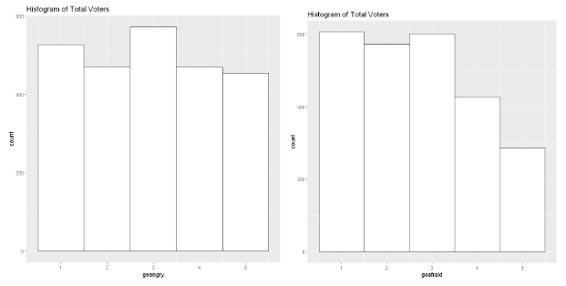

```{r knitr_options, include=FALSE}
library(knitr)
library(kableExtra)
library(ggplot2)
opts_chunk$set(fig.width=12, fig.height=4, fig.align="center", fig.pos="H",
               warning=FALSE, message=FALSE)
set.seed(53079239)
install.packages("kableExtra ggplot2", repos="http://cran.us.r-project.org")
```
It is important to note up front that there are potential problems with the collection of this sample of respondents. The Lab 2 assignment notes that the ANES pilot survey does not represent a random sample of the U.S. population, primarily because respondents were provided incentives to complete the survey and therefore not drawn at random. In addition, as we completed the assignment we noticed that some demographic subgroups of the sample -- such as race and party affiliation -- were not exactly consistent with other estimates of the true U.S. population. Because our sample was not drawn at random, it means the assumption of i.i.d. needed to conduct hypothesis testing cannot be fully satisfied. 

Acknowledging the shortcomings of the sample of survey respondents is an important caveat to any findings of this report. That said, we feel conducting statistical analysis on the sample of ANES survey results is still a worthy endeavor which we believe can provide interesting insights about recent U.S. voter behavior and encourage further analysis. 

## Question 1: Do US voters have more respect for the police or for journalists?

### Introduce your topic briefly

The survey asks voters how they would rate police and journalists; the variables are _ftpolice_ and _ftjournal_, respectively. These two variables are asked in questions phrased as "how would you rate the police/journalists." Data type for both variables is recorded as numerical values ranging [0,100] (parametric), with ratings between 50-100 degrees meaning that it is a favorable perception and 0-50 degrees representing an unfavorable perception toward the group stated in the question.
 
Assuming this magnitude of the rate represents the voters' respect towards police and journalists, we can use _ftpolice_ and _ftjournal_ to compare whether there is a difference in respect for the police and the journalists.  Since a) the numbers of total response match for the two variables (no missing value for each field; we will verify below) and b) we can assume both variables are independent and identically distributed (i.e. i.i.d) because there's no evidence the variables influence one another, _ftpolice_ and _ftjournal_ could be compared in pairs.

### Perform an exploratory data analysis (EDA) of the relevant variables

First, we conducted a sanity check. We found no missing data and confirmed that the distribution of the variables fall within the expected range, except for one outlier data for _ftjournal_. Let _ftpolice_ be _p_ and _ftjournal_ be _j_, $(p_{1}, j_{1}), (p_{2}, j_{2}), ... (p_{n}, j_{n})$ pairs are independent and random. So we can assume $Dif_{i} = (p_{i} - j_{i})$ is also independent and random. Let "dif" be the arbitrary pair, then expected difference is $\mu_{d} = E(p) - E(j) = \mu_{p} - \mu_{j}$$ The summary statistics and the histogram for $Dif_{i}$ shown below are normally distributed within the range of [-100,100].

``` {r, out.width='100%', fig.align='center', fig.pos='h', echo = FALSE}

```
``` {r, out.width='100%', fig.align='center', fig.pos='h', echo = FALSE}

```

### Based on your EDA, select an appropriate hypothesis test

From our EDA,

* The variables of respect for police and journalists are iid and can be paired
* The difference in the magnitude of respect for police and journalists ('dif' rv) shows normality and independence
 
Our null hypothesis will be that the difference between respect for police (_ftpolice_) and for journal (_ftjournal_) is none (same respect). Therefore, our alternative hypothesis will be that the difference is not equal to zero.
 
Given above, one-sample parametric t-test with the difference in pairs can be conducted instead of two-samples test for the statistical test. Fundamentally one-sample t-test and two-sample paired t-test for this question are the same. one-sample t-test compares one sample mean to a null hypothesis value, while a paired t-test simply calculates the difference between paired observations and then performs a one-sample t-test on the differences.

### Conduct your test

With the one-sample t-test result that the mean 12.42 with 2499 degree of freedom returns p-value of 2.2e-16 (much less than 0.01) at .05 significance level, we can conclude that there is statistical significance in the difference between voters rating of police compared to voter rating of journalist. That said, we can reject the null hypothesis.
 
Now considering the effect size which is the magnitude of the difference of 12.41 point out of 100 (95% CI 10.65 to 14.18), we could claim that the result is practically significant. Respect for police is higher in average 12.41 than the respect for journalists and this is large enough given the scale.

## Question 2: Are Republican voters older or younger than Democratic voters?

### Introduce your topic briefly

Political identity is influenced by numerous demographic factors that include gender, education, income, religion, ethnicity, and region. When we focus only on age, it is often believed that the older generation would likely be conservative (Republican) whereas younger generation tends to be liberal (Democratic), as indicated by a popular saying "If a person is not a liberal when he is twenty, he has no heart; if he is not a conservative when he is forty, he has no head." To check the validity of this hypothesis, we need to identify age and party identity of the voters. We can use _birthyr_ variable from the survey for age which asks voters "in what year were you born?". This question would prompt responses, which we can then use to indicate the age of the respondent in 2018 and analyze it with political identity.

Within the survey, there are two variables that ask party identity of each voter, _pid1d_ and _pid1r_. These identical variables are cross-checking if the voter has a clear party identity. Then follows a questionnaire for strongness, _pidstr_, which is one layer deeper in party identity. For those who do not have a clear party identity, the survey checks whether they have any closeness to either party. Because we only want to know Republicans and Democrats, we rule out voters who state political identity as 'something else'.

### Perform an exploratory data analysis (EDA) of the relevant variables

We create a dataset (named `q2df`) containing information of age, party id, strongness and closeness. We select only the variables mentioned above. 

Based on the sanity check, there's no weird value for each variables in the sub-dataset `q2df`. However, according to the survey definition, we need to manage the data with value of 'no answer -7','inapplicable/skip -1'. However there are two voters with no answer in either party identity question (_pid1d_, _pid1r_) and they don't show any identity for both legitimate questions. Therefore we can remove data with value '-7' for either party(_pid1d_) or party2(_pid1r_) variables.

We then convert '-1: inapplicable, legitimate skip' value to 0 and create another column (named `partyid`) that would consolidate party (_pid1d_) and party2 (_pid1r_) variables. Sanity check of unique values and abnormality is cleared accordingly.

The new label for the column of `partyid` is,

* 0 inapplicable, skip/ 1 Democrat/ 2 Republican/ 3 independent/4 something else

We subset Democrat and Republican by partyid, 1 & 2 respectively. The number of data points for each subset of voters who identified as Democrat and Republican is, Democrat = 857 and Republican= 609. 

``` {r, out.width='100%', fig.align='center', fig.pos='h', echo = FALSE}

```
``` {r, out.width='100%', fig.align='center', fig.pos='h', echo = FALSE}

```

It's hard to tell the difference in distribution from the histograms, but the compact boxplots support the intuitive finding that Republicans are older on average than Democrats.

### Based on your EDA, select an appropriate hypothesis test

Considering we want to compare the mean of two independent groups which are unrelated groups of samples. is unpaired, we choose to conduct unpaired-parametric test.

1. In this test, the null hypothesis ($H_{0}$) assumes that the true mean difference ($\mu_{d}$) is equal to zero.
2. The two samples have unequal variances and/or unequal sample sizes. Individual values are not paired or matched with one another.
3. Data are not normal. So nonparametric version of the test, which does not assume normality, is needed.
* the shapiro test below returns p-value of less than 0.01 for both birthyear of Democrats and Republicans
* two reason might explain this non-normality of the data, a) Skewness is present in the sample data and b) the age/birthyear data is only opened to left-tail (year 2000 and below), while non-voter population who are born after year 2000 cannot be captured in this ANES survey.

Here the sample sizes are unequal, unequal variances can influence the Type 1 error rate of the t-test by either increasing or decreasing the Type 1 error rate from the nominal (often 0.05) alpha level. So Mann-Whitney test should be appropriate in this test, because we can decide whether the population distributions are identical without assuming them to follow the normal distribution.

Other than Mann-Whitney test, we try to run Welch two sample t-test assuming the sample has normal distribution. Because of the non-probability sampling nature of this survey and data, there is a risk to assume that we can apply Central Limit Theorem with large sample size. However it would be worth cross-checking the results from Mann-Whitney test and Welch two-sample t-test.

### Conduct your test

At .05 significance level, we reject the null hypothesis that the age (birthyear) of Democrats and Republican in ANES are identical populations. Same result to reject $H_{0}$ is derived from Mann-Whitney U test. 

Welch-test shows us that with 95% confidence level the Republican voters are older than the Democrat voters by approximately 1 to 4 years (95% CI 0.87 to 4.27).

Cohen's d at 0.15 means the difference between the two groups in standard deviation unit is little or has no effect. That said, there is no practical significance for age difference between Democrats and Republicans even though statistical significance exists. (Even with the subset of stronger political identity groups, the results for statistical significance and practical significance remain the same.)

``` {r, out.width='100%', fig.align='center', fig.pos='h', echo = FALSE}

```
As the survey asks other demographic variables which can impact political party identity, we should analyze these other variables such as gender, race, education (_educ_ variable), religion (_religpew_ variable), and income. Gender influences a person's party identification, especially as major social issues gets thrown into the spotlight for debate, such as abortion, equal pay, and affirmative action. Race is often a prime contributing factor to political affiliation as the last half of the 20th century has shown African Americans and Mexican Americans have tended to be Democrats, while a subsegment of Hispanics showing strong tendencies to being Republicans. Ted Cruz and Marco Rubio are simple examples of this trend.^[1]^  Religious beliefs can also play a large role with Catholics taking a more conservative stance with social issues such as abortion and birth control, and Protestant Christians favoring Republicans for stance on family values and homosexuality. While education and income can have a liberalizing effect on individuals, it might not be statistically significant that this corresponds to actual liberals, as often the opposite is true when considering tax breaks for the wealthy, educated individuals.^[2]^

Although the above variables should be analyzed, one consideration is whether the sample set of the respondents in each would be large enough to yield statistically significant results. In order to have an analysis of higher confidence level a large sample size would be needed.

## Question 3: Do a majority of independent voters believe that the federal investigations of Russian election interference are baseless?

### Introduce your topic briefly

The party id questions used in Question 2 will be used to isolate independent voters. This set of questions (variables _pid1d_ and _pid1r_) ask respondents to name the political party with which they identify. If the respondent answers "independent", a follow up question (variable _pidlean_) asks if the respondent leans toward one party or the other.

The _russia16_ variable was chosen to represent whether a respondent believes the federal investigations of Russian election interference are baseless. This question asks whether respondents believe that the Russian government probably interfered in the 2016 presidential election. We feel it is reasonable to assume a respondent that believes the Russian government interfered in the 2016 election similarly believes the investigations into Russia's involvement are warranted.

For each of the variables above, number values are assigned to the answers for each question. Observations with a value of -1, -4, and -7 represent respondents for whom the question did not apply, have erroneous values, or skipped the question, respectively. 

Using the set of party id questions, we have developed two separate definitions for independent voters. The first definition includes any respondent who replied "independent" in the _partyid_ question (observations with a value of 3 in variables _pid1d_ or _pid1r_). The second definition is narrower and excludes those independent voters that lean towards one party or the other. In other words, this second definition is comprised of respondents with the value 3 in variable _pid1d_ or _pid1r_, **and** have a value of 3 ("neither") in the _pidlean_ variable. We believe testing two separate definitions of independent voters can help assess the varying levels of conviction held among self-proclaimed independents surrounding the contentious Russian investigation issue.

### Perform an exploratory data analysis (EDA) of the relevant variables

The exploratory data analysis revealed that 767 of the 2500 respondents fall into our broad definition of independent voters, making up roughly 31 percent of the sample. This proportion is below other estimates of total independent voters released around the same time as the ANES survey, which raises questions about the sample methodology and sample weights used for this survey.^[3]^  Our narrower definition of "strong" independent voters captures a smaller percentage of the sample population: 307 of the 2500 respondents, or approximately 12 percent. Regardless of the discrepancies between the percentage of independent voters within our sample versus outside estimates, we feel there is still value in pursuing this experiment while acknowledging these differences as an important caveat to our results. After all, since we don't know the exact methodologies for capturing independent voters used by other researchers, it may not be appropriate to directly compare other estimates with the ones in our sample.  

Once we have filtered the sample to include only observations that satisfy our first definitions of independent voters, we explore how this smaller group of respondents answered the _russia16_ question. Every observation for the _russia16_ variable has a value of either 1 or 2, meaning there are no respondents for whom the question did not apply, have erroneous values, or skipped the question. The same can be said for the narrower sample of independent voters. The mean value for _russia16_ for the broad independent voter sample is 1.45, while the mean value for strong independents is 1.48, both of which pass a reasonable sanity test. 

### Based on your EDA, select an appropriate hypothesis test

Based on the exploratory data analysis, the correct type of test is a one-sample, parametric t-test. The assumptions needed in order to validate this type of test is that the sample is i.i.d and drawn from a normally distributed population. The potential issues surrounding the randomness of our sample and independence of observations have been well documented, however, notwithstanding this important caveat, we still believe conducting this statistical analysis is worthwhile (see discussions in earlier sections). Additionally, even though the population distribution is probably not exactly normally distributed -- in fact it the population distribution of sentiment toward the Russian election interference most likely resembles a binomial distribution -- studies indicate with a large enough sample size the t-test is still fairly robust.

In this particular test, our null hypothesis is that the mean of the _russia16_ variable among independent voters equals 1.5 percent, which would indicate that neither a majority nor a minority of independent voters believe that the federal investigations of Russian election interference are baseless. If the mean of our sample of independent voters is statistically significantly less than 1.5, that would imply -- but cannot fully prove -- that independent voters believe the Russian government was involved in the 2016 election. 

Therefore, our alternative hypothesis is that the mean is not equal to 1.5. A two-tailed test is preferred. As mentioned previously, even though the research question asks whether a majority believe the investigations are baseless (which implies a one-tailed test to see if the sample mean is greater than 1.5), there are reasons to conduct a two-tailed test regardless. There is a temptation to use the one tail test when the two tail test fails, just so that one can reject the null hypothesis. To conduct a one-tail test, the examiner is essentially saying he/she would not reject the null hypothesis no matter how far it is from the population mean on the opposite side. The examiner has to work harder to justify that. Therefore, a two-tail test is preferable in most situations.

### Conduct your test

When testing the broader sample of independent voters with a confidence level of 0.95, the mean of 1.45 with 766 degrees of freedom returned a p-value of 0.0067. With this result, we reject the null hypothesis that the sample mean equals 1.5, and can state that the mean of 1.45 is statistically significantly different from 1.5. These results suggest a majority of independent voters believe the federal investigations into Russian involvement in the 2016 election are warranted. However, a calculation of the Cohen's D effect size gets a value of 0.098, which indicates the practical difference is very small.

When testing the narrower sample of strong independent voters with a confidence level of 0.95, the mean of 1.479 with 306 degrees of freedom returned a p-value of 0.459. With this result, we fail to reject the null hypothesis that the sample mean equals 1.5. These results suggest a majority of strongly independent voters neither believe nor disbelieve the Russian government was involved in the 2016 election. Calculating a practical difference is not necessary, since there is no statistical difference between the two means.

Therefore, based on these results, we found no evidence to suggest that independent voters in our sample  believe that the federal investigations of Russian election interference are baseless. In fact, when testing the broader sample of independent voters, we found statistically significant evidence to suggest the opposite is true, although the practical significance is relatively small.

It's difficult to say why the broad definition of independent voters feel more strongly that the Russian government was involved in the 2016 election (and therefore the federal investigations are warranted). One potential explanation is that, while the majority of respondents that answered "independent" in the party id question answered "neither" in the party-id-lean question, a majority of the remainder of independents leaned toward Democrat. Those that lean Democrat are likely more inclined to believe the Russian government was involved in the 2016 election, which could be skewing the broader definition of independents towards believing in the legitimacy of the federal investigations. 

## Question 4: Was anger or fear more effective at driving increases in voter turnout from 2016 to 2018?

### Introduce your topic briefly

The question of whether anger or fear was more effective at driving increases in voter turnout from 2016 to 2018 is interesting because more people actually voted in 2016 than in 2018, both within the ANES respondent sample and in the U.S. population. This isn't surprising; Presidential elections have historically garnered more participation than midterm elections. Nevertheless, the following sections will attempt to assess which emotion -- anger or fear -- was a more salient driver of voter participation in 2018. 

A number of variables have to be considered. First, the 2016 and 2018 election turnout survey questions ask respondents if they voted in each respective election (variables turnout16 and turnout18). For each question, if the respondent answered "unsure" a follow up question prompts respondents to indicate if they believe they voted or not (variables _turnout16b_ and _turnout18ns_). For each of these variables, number values are assigned to the answers for each question. Observations with a value of -1, -4, and -7 represent respondents for whom the question did not apply, have erroneous values, or skipped the question, respectively. 

In order to measure voter turnout in 2018, observations with values of 1, 2, or 3 in _turnout18_, as well as a value of 5 in _turnout18_ **and** a value of 1 in _turnout18ns_ should be included. Similarly, to measure people who did **not** vote in 2016, observations with a value of 2 in _turnout16_, as well as a value of 3 in _turnout16_ **and** a value of 2 in _turnout16b_ should be included.

Next, there are 3 sets of variables that assess fear and anger: i) the Global Emotional Battery questions (_geangry_ and _geafraid_) asks respondents if they feel angry or afraid, ii) the Trump Emotional Battery asked only of Form 1 (_dtangry_ and _dtafraid_) asks if respondents feel angry or afraid specifically due to Donald Trump, and iii) the Policy-Specific Emotional Battery asked only of Form 2 (_imangry_ and _imafraid_) asks if respondents feel angry or afraid because of immigrants. Each of these variables utilize a Likert scale, with numbers 1 through 5 representing whether the respondent feels that emotion (anger or fear) from "Not at all" to "Extremely".

Since respondents were not asked directly which emotion drove them to vote in 2018, we cannot directly measure if there is a statistical difference between fear and anger as a driving factor of voter turnout. Therefore, we will have to use the variables available while making a few assumptions. We will conduct 3 sets of tests in order to address this questions:

1. All survey respondents will be tested to see if there is a statistical difference between the amount of fear they feel versus the amount of anger, across the three sets of battery questions.
2. The same three tests in #1 will be conducted while limiting the sample to only those respondents that voted in 2018. In this way, we hope to capture more of the effect that these two emotions had on a respondent's propensity to vote in 2018.
3. The same test in #1 will be conducted while limiting the sample to only those respondents that did not vote in 2016, but then voted in 2018. An important assumption is that these respondents were "driven" to vote since 2016, and if these respondents feel one emotion (fear or anger) more than the other, then that emotion may have been a more salient factor in driving them to vote. In this case, we will have to exclude those respondents who couldn't vote in 2016 because they were not old enough.

### Perform an exploratory data analysis (EDA) of the relevant variables

The variables for each of the emotional battery questions had values equal to -7, meaning there were some respondents that did not answer the question. These values were removed because they inaccurately distort the mean value of each variable. Similarly, the Donald Trump and immigrants emotional battery questions both had many observations with a value of -1 because each of these questions were only asked of half the respondents. Therefore, respondents with a value of -1 were removed for the purposes of this analysis, again because these values will skew the mean for each question to the downside. 

``` {r, out.width='100%', fig.align='center', fig.pos='h', echo = FALSE}

```
Even after removing these values, there is still a rather large amount of observations with valid responses for each of the three emotional battery questions. This is still the case when the sample is limited further to include only those respondents who voted in 2018. However, when limiting our sample to respondents who voted in 2018 but not in 2016, and after correcting for those respondents who were not old enough to vote in 2016, there are only 16 total respondents who answered the general emotional battery question, and even fewer who answered either the Donald Trump or immigrants questions. With such a small number of observations, the statistical power of any of our hypothesis tests will be limited. Therefore, for respondents who did not vote in 2016 but voted in 2018, we only test if there is a statistical difference between feeling angry versus feeling afraid in the general emotional battery questions (skipping hypothesis tests for the Donald Trump or immigrants questions). 

### Based on your EDA, select an appropriate hypothesis test

After conducting an exploratory data analysis, it was determined that a Wilcoxon signed-rank test for related conditions is most appropriate. The determining factor for using a non-parametric test is that the emotional battery variables are ordinal. Parametric tests should not be used in most cases with ordinal variables because it is difficult to assume that values have an equally likely chance of being chosen. 

The signed-rank test is used for two dependent samples. As in question 1, we believe there could be a correlation between how an individual responds to the two separate questions. We want to ascertain whether the answers to the two questions concerning anger or fear are statistically different, however, there is dependency between the two questions because each are answered by the same group of respondents. 

In order to assess whether fear or anger is a more important driver of voting in 2018 we have decided to conduct many different iterations of our hypothesis tests. Unfortunately, the more hypothesis tests conducted increases the probability of type 1 error, or the probability of rejecting a true null hypothesis. Therefore, a Bonferroni correction will be utilized in order to increase the validity of the resulting statistical significance. 

### Conduct your test

The results of our hypothesis tests are distilled in the table below. One can see both the statistical and practical significance for each test. Based on our sample, in general, anger seems to be the more salient driver of voter turnout. That said, after correcting p-values for possible type I errors, the only statistically significant results were for the general and Donald Trump emotional battery questions. The test for respondents who voted in 2018 but not in 2016 also did not produce statistically significant results, likely because of the diminished degrees of freedom. 

While this research question could not be directly answered, the overall results of our tests given the available questions in this survey were not particularly robust. There seems to be some statistical evidence to suggest that anger was a more important emotional driver in the 2018 election, at least in the general emotional battery questions and when asked about Donald Trump specifically. However, the practical significance is not very notable. 

``` {r, fig.align='center', fig.pos='h', echo = FALSE}
knitr::include_graphics("images/figure_2-2.png")
```

## Question 5: Select a fifth question that you believe is important for understanding the behavior of voters

### Clearly argue for the relevance of this question

The United States' 2016 presidential election ended in victory for Donald Trump, and proved to be an unprecedented upset that stunned the world.  Prior to the election, most pundits predicted that Hillary Clinton would win the White House.  However, by evening's end, pollsters faced a barrage of questions regarding how their consistent predictions in favor of Clinton proved to be so wrong.  Statisticians blamed everything from polls' under-sampling populations that overwhelmingly favored Trump (including under-educated white voters) to "hidden Trump voters" too ashamed to express their true preferences when asked.^[4]^  The possibility of a Trump victory had long been explained away.

Voter demographics in the 2016 presidential election showed there to be striking differences in candidate preferences between white and non-white voters.  An exit poll conducted by Edison Research for the National Election Pool showed black and hispanic voters to prefer Clinton over Trump by 80- and 36-point margins, respectively.  White voters, however, voted for Trump by a 21-point margin.^[5]^  Trump's victory motivated traditionally-Democratic minorities to encourage voter registration among their communities.  However, Republicans, seeing the threat of a Democratic majority seated in the U.S. House of Representatives, called for greater voter participation among their ranks in the 2018 midterm elections.  2018's National Voter Registration Day -- roughly one month away from the midterm election -- witnessed a record 865,015 registrants.^[6]^  Both parties -- as well as members of ethnic communities that identify with one political party over another -- had significant reasons to encourage individuals to vote.

Differences in voter registration trends among various ethnicities between the 2016 and 2018 elections led us to ask the question,

> *Following the 2016 presidential election, were whites or non-whites more likely to begin participating in the United States' electoral process and register to vote?*
>

#### Race as an identifier of ethnicity

We acknowledge that separating subjects' race into one of two categories may introduce questions.  Race, in this context, is considered a self-identified ethnicity and, like its interpretation in United States Census Bureau data, not defined "biologically, anthropologically or genetically".^[7]^  However, unlike Census Bureau data, the ANES survey restricts respondents to identifying with only one ethnicity; one could not choose to identify as both "white" and "Hispanic" which suggests the potential for a different socioeconomic status, different voting habits, and the like.  Without this level of specificity, we consider respondents to have either identified as white or not as white.

This separation of respondents is not unique to our analysis.  For example, analyses from the Pew Research Center separate whites into an independent category of ethnicity in published voter polling data.  However, we propose that this categorization should encourage further analysis using more specific racial categories based upon the results of our analysis.

### Perform EDA and select your hypothesis test

Variables within the ANES survey of importance to our chosen question include the following.  Prior to exploring our question, data was cleaned of irrelevant data (see "Exploratory Data Analysis", below) and managed in an R data frame for accessibility.

Create a data frame with only columns required for the analysis, providing greater ease with which to analyze the data as well as facilitating visibility into data using functionality associated with `data.frame` objects.

##### _race_

* Data is numeric, with positive integers associated with each race.
* Respondents that did not answer are assigned a value of -7, and their data removed from the analysis (`length(race[race == -7])` = 1).
* No data is missing (`sum(is.na(race)) == 0`).

Respondents identifying race as white versus those identifying as not white totaled 1,854 (74.19%) and 645 (25.81%), respectively.  This division is similar to that recorded in the Census Bureau's 2017 American Community Survey identifying only one race as ethnicity (72.30% vs. 24.41%).^[8]^

##### _turnout16_

* Data is numeric, with positive integers associated with respondent voting behavior (definitely voted, definitely did not vote, and unsure) in the 2016 election.
* No data is missing (`sum(is.na(turnout16)) == 0`).

Respondents identifying that they definitely voted are assumed to also be registered to vote.
Respondents that indicated they definitely voted and registered to vote within the last one to two years were assumed to have registered to vote in 2016 prior to the election.  They are consequently not considered to have begun participating in the electoral process as a result of the 2016 election.

##### _turnout18_

* Data is numeric, with positive integers associated with respondent voting behavior (definitely voted in person before election day, on election day or by mail; definitely did not vote, and unsure) in the 2018 election.
* No data is missing (`sum(is.na(turnout18)) == 0`).

According to estimates, turnout throughout the United States for the 2018 midterm election totaled 50.3% of the American electorate.^[6]^  Compared to the percentage of ANES survey respondents identifying voting behavior in 2018 (95.48%), this could suggest that ANES survey data is not independent and identically distributed (iid); respondents to the survey may be more politically active or demonstrate greater interest in politics than the American electorate.  This could skew results for both whites and non-whites, as demonstrating greater interest in politics could also encourage respondents to register to vote.  This potential for skewing percentages is not considered in our analysis, but must be acknowledged should further analyses be performed.

##### _reg_

* Data is numeric, with positive integers identifying whether a respondent is registered to vote, regardless of current address.  Presumably this value reflects voter registration status at the time the ANES survey was conducted (December 6 - 19, 2018), approximately four to six weeks following the 2018 election.  There is a possibility that a respondent registered to vote following the election, and therefore did not participate in the 2018 election.
* Respondents that did not answer are assigned a value of -7, and their data removed from the analysis (`length(reg[reg == -7])` = 1).
* Only data for respondents registered to vote were included in the analysis.
* No data is missing (`sum(is.na(reg)) == 0`).

Respondents identifying definite voting behavior and those not sure totaled 2,023 (80.99%) and 476 (19.05%), respectively.  Removing those not registered to vote reduces the number of observations in the ANES survey by 476.

##### _whenreg_

* Data is numeric, with positive integers providing a rough estimate of when the respondent registered to vote (e.g. within the last year, the last one to two years, the last three to four years, and five years or more).
* Those whose responses were inapplicable or legitimately skipped the question are assigned a value of -1, and their data removed from the analysis (`length(whenreg[whenreg == -1])` = 477).
* No data is missing (`sum(is.na(whenreg)) == 0`).

As noted above, respondents indicating that they registered within the last one to two years and that they definitely voted in the 2016 election are considered not to have begun participating in the electoral process as a result of the 2016 election.

##### _howreg_

* Data is numeric, with positive integers associated with the means by which the respondent registered to vote the first time (e.g. online, mail).
* Only those respondents identifying that they are registered to vote were asked this question.  However, the number of respondents' answers identified as "inapplicable, legitimate skip" totaled 2,300 (`length(howreg[howreg == -1])` = 2300).  Removing these respondents from the analysis would reduce the number of observations in the ANES survey by 92%.
* No data is missing (`sum(is.na(howreg)) == 0`).

All survey labels identifying a specific means of how one registered to vote identify voluntary means of registration.  Aside from not responding or responding "Other", respondents were not provided a choice specific to involuntary registration (e.g. some states automatically register voters when one registers their vehicle).  Because involuntary registration methods cannot identify volition (e.g. some respondents might have wanted to register, and were registered albeit by involuntary means), and because the lack of responses reduces the number of observations by 92%, we have chosen not to include data associated with the _howreg_ variable in our analysis.

#### Developing a null hypothesis and an appropriate test

Because we are comparing values associated with two separate categories (i.e. white and non-white) from within the same sample, we must divide the sample population in two.  Proportions of voters registering following the 2016 election -- based upon race -- must be calculated using sub-samples associated with the respective races.  Within the ANES survey data, 1,854 respondents identified their race as white, and 645 respondents identified their race as not white.

Our null hypothesis is as follows:

> *Following the 2016 presidential election, there is no significant difference between the number of whites and the number of non-whites beginning to participate in the United States' electoral process and registering to vote.*
>

Similarly, our alternative hypothesis is as follows:

> *Following the 2016 presidential election, there is significant difference between the number of whites and the number of non-whites beginning to participate in the United States' electoral process and registering to vote.*
>

Leveraging R's `prop.test` method to compare two proportions is appropriate.  Because our alternative hypothesis does not specify whether white respondents' registration rates are expected to be less than or greater than non-white respondents', we will use a two-sided test, and specify a confidence level of 0.95.

### Conduct your test

``` {r, echo = FALSE}
setwd(".")
A <- read.csv("./master/anes_pilot_2018.csv")

q5_df <- data.frame(race = A$race, birthyr = A$birthyr, turnout16 = A$turnout16, turnout18 = A$turnout18, reg = A$reg, whenreg = A$whenreg)

q5_df$white = q5_df$race == 1

q5_df <- q5_df[q5_df$race != -7 & q5_df$reg != -7 & q5_df$whenreg != -1,]
q5_df <- q5_df[q5_df$turnout16 != 3,]
q5_df <- q5_df[q5_df$turnout18 != 5,]

# nrow(q5_df[q5_df$birthyr == 1998 & (q5_df$whenreg == 2 | q5_df$whenreg == 3),])
# q5_df <- q5_df[q5_df$birthyr != 1998 | (q5_df$birthyr == 1998 & (q5_df$whenreg != 2 & q5_df$whenreg != 3)),]

q5_df <- q5_df[q5_df$reg != 3,]

registered_post2016_df <- q5_df[
  (q5_df$whenreg == 1 | q5_df$whenreg == 2) &
  q5_df$turnout16 == 2
,]
registered_post2016_white <- length(registered_post2016_df$white[registered_post2016_df$white == TRUE])
registered_post2016_nonwhite <- length(registered_post2016_df$white[registered_post2016_df$white == FALSE])
```

``` {r}
prop.test(
  x = c(registered_post2016_white, registered_post2016_nonwhite), 
  n = c(length(A$race[A$race == 1]), length(A$race[A$race > 1])), 
  alternative = "two.sided", 
  conf.level = 0.95,
  correct = FALSE
)
```

### Conclusion

With a calculated p-value of 7.523e-05 and a confidence interval between -0.04758164 and -0.01172946, we can safely reject our null hypothesis.  However, the assumption that ANES survey is not independently and identically distributed -- specifically considering the nearly two-to-one voter participation ratio in the 2018 election -- begs for further analysis.  It is possible that the ANES survey respondents represent a more politically active population, given their participation in ANES surveys.

``` {r, fig.align='center', fig.pos='h', echo = FALSE}

```

Still, an analysis of ANES data suggests that a greater proportion of non-white respondents were motivated to register to vote following the 2016 election when compared to the proportion of white respondents; proportions were calculated as 0.01995685 and 0.04961240 for white and non-white respondents, respectively.  Data suggesting this difference in proportions according to one's ethnicity -- nearly 2.5 to 1 -- call for further analysis, perhaps with a more independent representation of respondents.

## References

1. Yamily Habib, "Is there really a Republican Latino?", Al Dia National, 16 August, 2018; available from http://aldianews.com/articles/politics/national/there-really-republican-latino/53640.
2. Natalie Jacewicz, "What Shapes Your Political Beliefs at 18, 35, and 50", The Cut, 28 April 2017; available from https://www.thecut.com/2017/04/what-shapes-your-political-beliefs-at-18-35-and-50.html.
3. "Party Affiliation", Gallup; available from https://news.gallup.com/poll/15370/party-affiliation.aspx.
4. Kenneth P. Vogel and Alex Isenstadt, "How did everyone get it so wrong?", Politico, 9 November 2016; available from https://www.politico.com/story/2016/11/how-did-everyone-get-2016-wrong-presidential-election-231036.
5. Alec Tyson and Shiva Maniam, "Behind Trump's victory: Divisions by race, gender, education", Pew Research Center: Fact-Tank, 9 November 2016; available from http://www.pewresearch.org/fact-tank/2016/11/09/behind-trumps-victory-divisions-by-race-gender-education/.
6. "2018 National Voter Registration Day Final Report", National Voter Registration Day, 2018; available from https://nationalvoterregistrationday.org/about/2018-report/.
7. "Race - FAQ", United States Census Bureau, 4 January 2017; available from https://www.census.gov/topics/population/race/about/faq.html.
"American FactFinder", United States Census Bureau, 2017; available from https://factfinder.census.gov/faces/nav/jsf/pages/index.xhtml.
8. "2018 November General Election Turnout Rates", United States Election Project, 14 December 2018; available from http://www.electproject.org/2018g.
